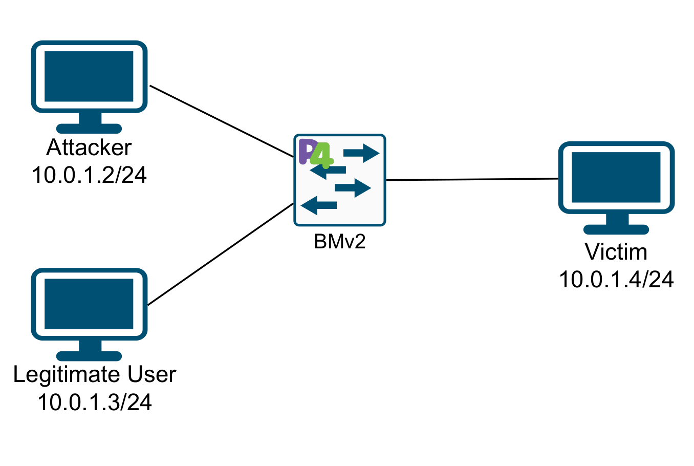

# A first demo of Quantization-Aware Training with P4

## Introduction

The present code is a preliminary implementaiton of a solution that combines P4 programmable switches and a Perceptron applied to detect DDoS Attacks.

This code is executed in an instance of the P4.org virtual machine. In particular, we started to work with the release of December 15 2025, were we installed and deployed the code. An image of the virtual machine can be downloaded from [here](xxxxxx).

## Used topology
The topology used for this evaluation is the same displayed for the QCMP paper. In our case, the topology is configured with static routing, which is defined in the runtime files located at the pod\_topo subfolder:

In this preliminary version, the RL agent only operates in the S1 switch.

## Reporting a Bug
If you find any problem trying to execute this code, please send a mail to [sergio.gutierrezb@udea.edu.co](mailto: sergio.gutierrezb@udea.edu.co)
## License

The files are licensed under Apache License: [LICENSE](./LICENSE). The text of the license can also be found in the LICENSE file.

